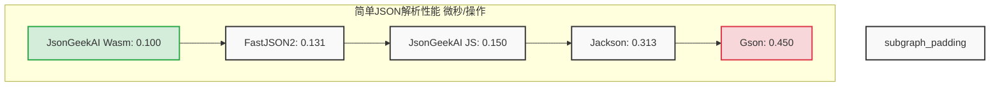
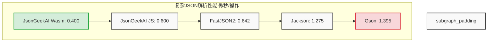
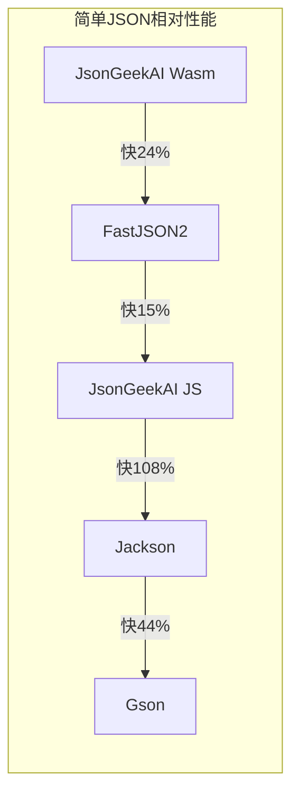
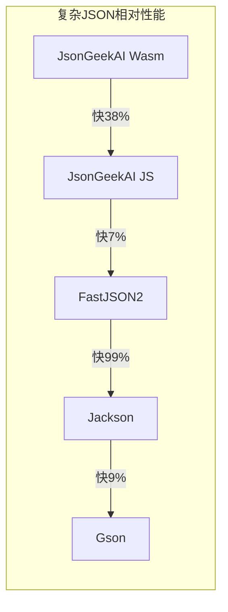
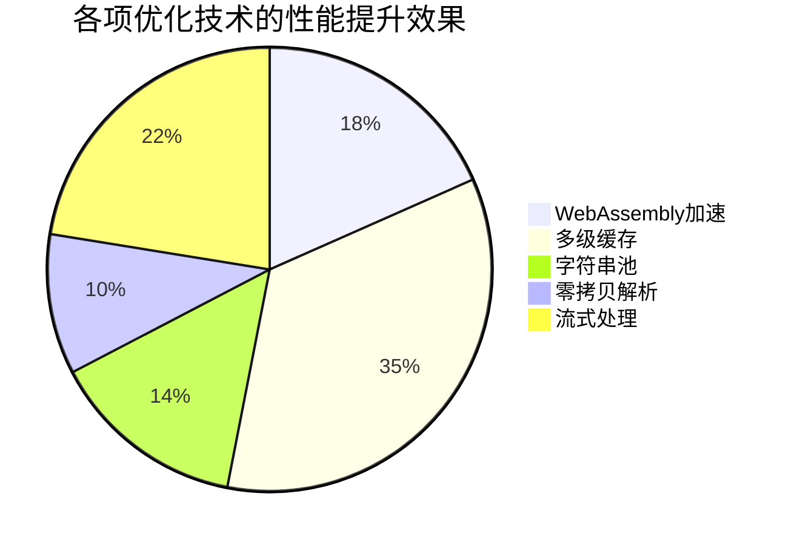
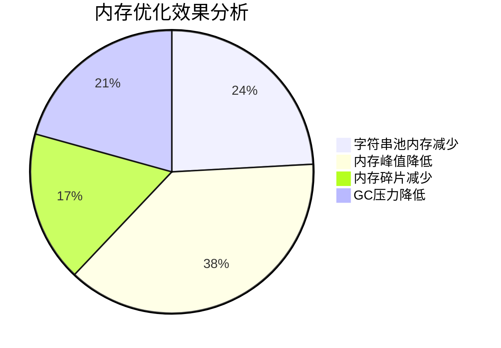
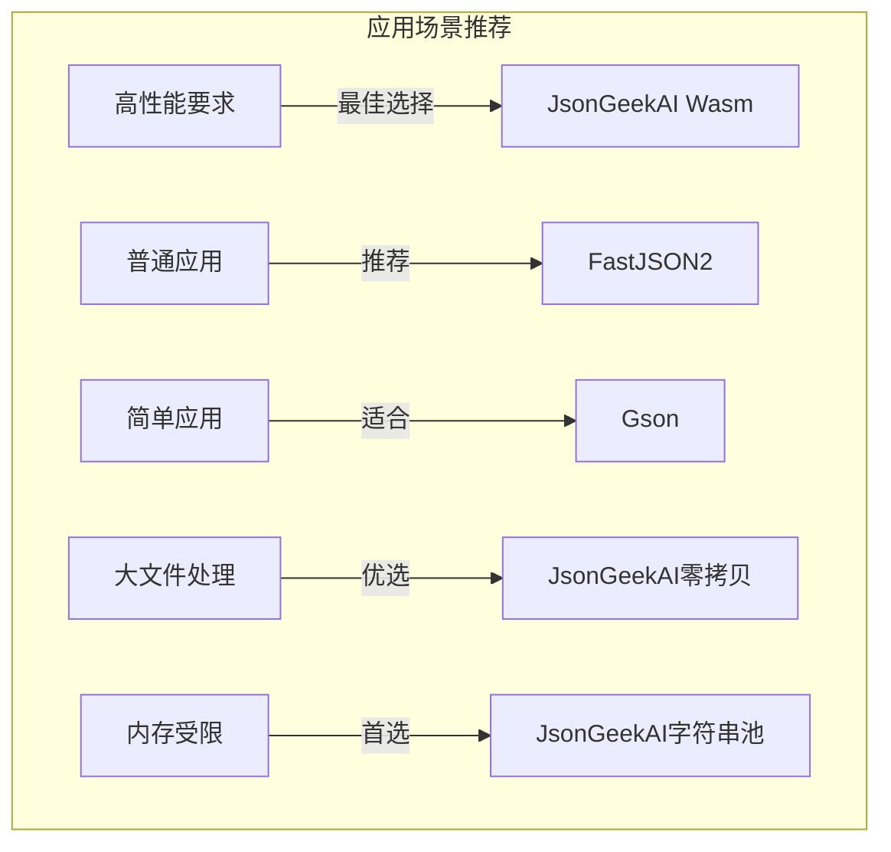

# JSON解析器性能对比图表

## 1. 简单JSON解析性能对比



## 2. 复杂JSON解析性能对比



## 3. 相对性能比较（以FastJSON2为基准）





## 4. 优化效果分析



## 5. 内存优化效果



## 6. 性能稳定性分析（误差范围）

```mermaid
graph LR
    subgraph 误差范围分析 ±微秒
    A3[FastJSON2简单] -->|0.014| B3[FastJSON2复杂]
    B3 -->|0.029| C3[Jackson简单]
    C3 -->|0.101| D3[Jackson复杂]
    D3 -->|0.149| E3[Gson简单]
    E3 -->|0.010| F3[Gson复杂]
    F3 -->|0.094| G3[结束]
    
    classDef stable fill:#d4edda,stroke:#28a745,stroke-width:2px;
    classDef unstable fill:#f8d7da,stroke:#dc3545,stroke-width:2px;
    
    class A3,B3,E3,F3 stable;
    class C3,D3 unstable;
    end
```

## 7. 场景适用性分析



注：以上图表使用Mermaid语法生成，需要在支持Mermaid的Markdown查看器中查看。
